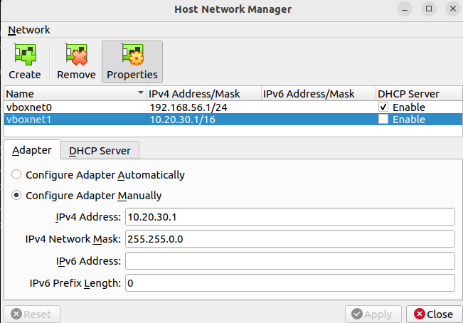

# References
- https://www.virtualbox.org/manual/ch06.html
- https://www.nakivo.com/blog/virtualbox-network-setting-guide/

----
# ViratualBox Network Modes
- Not attached (No connection)
- NAT
- NAT Network
- Bridged Adapter
- Internal networking
- Host-only 
- Generic (shared with the host)

## NAT
- Sufficient in most cases
- Internet-enabled: from Internal network to Internet access is possible
- Guests on internel network CANNOT talk each other
- (from www.nakivo.com)
- Enabling NAT for a VM with VBoxManage: `VBoxManage modifyvm VM_name --nic1 nat`
  - VM_name: name of a virtual machine
  - nic1: number of virtual machine adapter

## NAT Network
- Similar to NAT, but guest CAN talk each other
- basically,, CANNOT access guest machines either from the host or from external network
  - However, "Port forwarding" enables the host or the machines of the host network to access guests
- A built-in VBox NAT router uses
- Network address and name can be changed: (Global preference) File > Preferences > Network > Edit the settings(icon): Default address 10.0.2.0/24(GW 10.0.2.1, DHCP 10.0.2.3) can be changed to 192.168.xx.0/24(GW x.x.x.1, DHCP x.x.x.3)
- (from www.nakivo.com)
- Adding a new NAT Network with VBoxManage: `VBoxManage natnetwork add --netname mynatnet1 --network "192.168.15.0/24" --enable`
- Configuring a VM to use NAT Network with VBoxManage: `VBoxManage modifyvm VM_name --nic1 natnetwork`
  - nic1: the first virtual network adapter(network interface controller)

## Bridged Adapter
- The host and guest share the physical NIC (thanks to net filter)
- Guests can access the Internet as the host does
- "Promiscuous mode" can be enabled with this mode
- (from www.nakivo.com)

## Internal
- Guests can talk each other, but CANNOT communicate with the host nor access to the external network 
- models real networks
- (from www.nakivo.com)

## Host-only
- Geusts and the host can talk each other
- A Host-only network adapter can be set by File > Host Network Manager > (Adapter tab)
  - Default network address can be changed
  - DHCP can be set on/off
  - No Gateway presented (since outer world do not access into the host-only network)
- (from www.nakivo.com)


----
# Create a subnet using the host-only networking mode

## Review a virtual switch
- File > Host Network Manager
- on "Host Network Manager" window, click the "Properties"(of "vboxnet0") button
  - Default IP: 192.168.56.1/24
  - Default DHCP: Enabled, 192.168.56.100/24 (192.168.56.101~192.168.56.254)
  
## Create another virtual switch for host-only networking
- [Trial1] We might want to create vboxnet1 and give the following properties:
  - Default IP: 10.20.30.1/24
  - Default DHCP: Disabled
- That cannot be done simply (https://forums.virtualbox.org/viewtopic.php?t=104357)
- [Trial2] create /etc/vbox/networks.conf that has the following line:
  ```
  * 10.20.30.0/24
  ```
  - In that file, "#" is used for comments
  - Examples in the above thread
    ```
    * 10.0.0.0/8 192.168.0.0/16
    * 2001::/64
    ```
  - `* 0.0.0.0/0 ::/0` allows any addresses (range control is disabled)
  - if `/etc/vbox/networks.conf` file exists with no ranges are specified, then no addresses will be assigned to host-only adapters
  - now, vboxnet1 can be set as follows:
  


