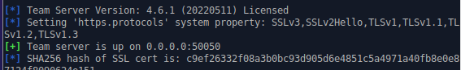
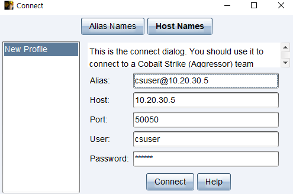

# Cobalt strike

## References
- Cobalt Strike's profile: https://blog.zsec.uk/cobalt-strike-profiles/
- Hashs of various Coblat Strike versions: https://verify.cobaltstrike.com/
- Craked versions (Chinese)
  - https://www.cnblogs.com/ssooking/p/12535998.html?from=timeline
  - https://www.ddosi.org/cobaltstrike-4-5-cracked/
  - https://github.com/Snowming04/CobaltStrike4.0_related
  - https://breached.vc/Thread-Cobalt-Strike-4-4-Crack-Tool
  - https://breached.vc/Thread-Cobalt-Strike-4-7
  - https://breached.vc/Thread-Cobalt-Strike-4-6-1-7-Brute-Ratel
- Raphael Mudge(the creator of Cobalt Strike)'s channel: https://www.youtube.com/@DashnineMedia
- "Cobalt Strike User Guide" by FORTRA, https://hstechdocs.helpsystems.com/manuals/cobaltstrike/current/userguide/content/topics/welcome_main.htm#

## Notes
- Well-known groups that use Cobalt Strike (https://attack.mitre.org/software/S0154/): FIN6, Iranian{CopyKittens}, NorthKorean{APT37}, Russian{Wizard Spider, Indrik Spider, APT29}, Vietnamese{APT32}, Chinese{Aquatic Panda, Chimera, Leviathan, Threat Group-3390, APT19, meenuPass, APT41, Mustang Panda, Earth Lusca}, DarkHydrus, FIN7, Cobalt Group

## Preparing VMs
- Team Server @ Xubuntu 22.04
  - Network: Host-Only Adapter(vboxnet1), 10.20.30.5/24, GW 10.20.30.1
  - default-jre (ver. 11) installed
- Client#1 @ Windows 10
  - Network: Host-Only Adapter(vboxnet1), 10.20.30.4/24, GW 10.20.30.1
  - Java 11.0.2 Installed (https://jdk.java.net/archive/)
- (optionally,) Client#2 @ Windows 10
  - Network: Host-Only Adapter(vboxnet1), 10.20.30.6/24, GW 10.20.30.1
  - it's a clone of the Client#1
- Now guest can ping each other
  - FYI, Window 10 opted out the ping service by default => For pinging each other, Windows Defender Firewall Off (or set the "ICMP Echo Request(ICMPv4-in)" rule applied for when the remote host is "local subnet")

## Starting the Team Server @ Xubuntu
- if necessary, give +x for files
- `./teamserver _SERVERIP_ _PW_`

  

- (c.f.)
  ```
  teamserver <host> <password> [path/to/C2.profile] [YYYY-MM-DD]
  ```
  - host: IP of the TS
  - password: shared password to connect to the TS
  - profile: Malleable C2 profile
  - date: kill date for Beacon payloads run from the TS
  - it may use existing X509 certificate and keystore for SSL
  - then the server will be up on 0.0.0.0:50050 and start listening http_beacon

## Staring the client#1 @ Win10
- Run
  ```
  java -XX:ParallelGCThreads=4 -XX:+AggressiveHeap -XX:+UseParallelGC -jar _CLIENT_.jar $*
  ```
- A dialog pops up

  
  
- As a connection established, a "joined" message is displayed on the CS main window

## Starting the client#2 @ Win10
- Run as the above
- Users connected to the teamserver shows up on the screen:
  